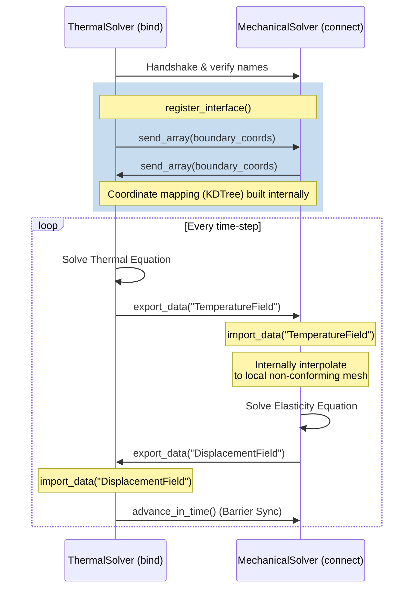
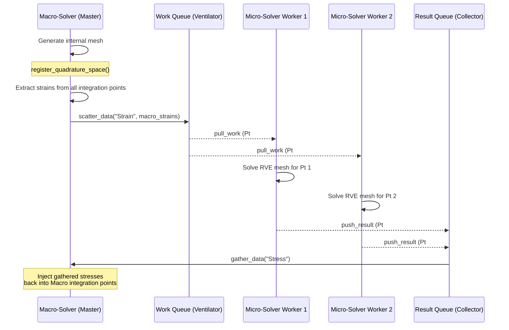

# FEniCSx CoSim Architecture

`fenicsx-cosim` is an inter-process communication library designed to enable partitioned multiphysics simulations across distinct FEniCSx solvers. It supports both **boundary-coupled 1-to-1 simulations** (e.g., Fluid-Structure Interaction or Thermo-Mechanical coupling) and **multiscale 1-to-N computational homogenization** (e.g., FE² framework).

The framework abstracts away network programming (ZeroMQ), data mapping (non-conforming mesh interpolation), and data formatting/serialization, allowing scientists to focus strictly on PDE formulations.

---

## 🏗️ Core Components

1. **`CouplingInterface`**: 
   The single entry point and API facade. Researchers interact exclusively with this object to orchestrate data extraction, mapping, communication, and injection.

2. **`Communicators`**:
   - `Communicator` (PAIR mode): A 1-to-1 persistent ZeroMQ connection for boundary exchange across staggered physics solvers.
   - `ScatterGatherCommunicator` (PUSH/PULL mode): A fan-out/fan-in topology designed to distribute heavy independent integration point calculations to thousands of worker solvers (FE²).

3. **`Extractors`**:
   - `MeshExtractor`: Extracts physical coordinates and degrees-of-freedom exclusively on the domain boundaries/facets to minimize data transmission.
   - `QuadratureExtractor`: Manipulates tensors directly at the integration (Gauss) points of elements rather than at nodes.

   - `NearestNeighborMapper`: Provides fast geometric nearest-neighbor interpolation when the interacting meshes do not match (non-conforming grids).
   - `DynamicMapper`: An extension handling Adaptive Mesh Refinement (AMR); automatically recomputing the point clouds and interpolations mid-simulation without restarting.

5. **`Adapters`** (Multi-Solver Pattern):
   - `SolverAdapter` (ABC): The contract for hooking external solvers into `fenicsx-cosim`.
   - `FEniCSxAdapter`: The default adapter wrapping `MeshExtractor`.
   - `KratosAdapter`: Live memory-based coupling using the Kratos Python API.
   - `AbaqusFileAdapter`: File-based staggered coupling for Abaqus wrappers.

---

## 🔄 Two Main Workflows & API Flow

There are two primary paradigms natively supported by `fenicsx-cosim`. You can choose which one applies to your research geometry.

### 1. Standard Boundary Coupling (Thermo-Mechanical, Fluid-Structure)
*In this paradigm, two solvers solve independent domains tracking distinct physics, exchanging fields across a shared boundary interface.*

#### 📈 Sequence Flow Diagram

**ASCII Visualization:**
```text
+-------------------+                                  +-------------------+
|  Thermal Solver   |                                  | Mechanical Solver |
|    (Role: Bind)   |                                  |  (Role: Connect)  |
+-------------------+                                  +-------------------+
        |                                                       |
        | ------------- 1. register_interface() --------------> |
        | <-------------   (Exchanges Coords)   --------------- |
        |                                                       |
        | ------------- 2. export_data("Temp") ---------------> |
        |                 (maps & interpolates)                 |
        |                                                       |
        | <---------- 3. export_data("Displacement") ---------- |
        |                 (maps & interpolates)                 |
        |                                                       |
        | -------------- 4. advance_in_time() ----------------> |
        | <-------------     (Barrier Sync)   ----------------- |
        |                                                       |
```

*(A Mermaid.js version is also provided below if viewing on GitHub/GitLab)*


#### 🔑 Key API Calls:
1. `cosim = CouplingInterface(..., connection_type="tcp", role="bind"/"connect")`
2. `cosim.register_interface(mesh, facet_tags, marker_id=1)`: Tells the framework where the shared boundary is located and exchanges coordinates to build interpolation mappings.
3. `cosim.export_data("FieldName", function)`: Paces numerical values from the FEniCSx function at the boundary and sends them to the partner.
4. `cosim.import_data("FieldName", function)`: Receives data, maps it from the remote grid to the local grid, and injects it into the FEniCSx function.
5. `cosim.advance_in_time()`: Ensures neither solver sprints ahead out of sync.

---

### 2. FE² Scatter-Gather (Multiscale Homogenization)
*In this paradigm, a single macroscopic mesh computes strains at its integration points. It then broadcasts these strains to a pool of microscopic Representative Volume Element (RVE) worker solvers to compute homogenized stresses.*

#### 📈 Sequence Flow Diagram

**ASCII Visualization:**
```text
+-------------------+
|   Macro Solver    |
|  (ScatterGather)  |
+-------------------+
  |    |    |   ^
  |    |    |   | 3. gather_data("Stress")
  |    |    |   +------------------------------------+
  |    |    |                                        |
  |    |    +----------------+                       |
  |    +---------+           |                       |
  v 1. scatter   v           v                       |
+--------+   +--------+   +--------+                 |
| Worker |   | Worker |   | Worker |   (Queue pull)  |
|  RVE 1 |   |  RVE 2 |   |  RVE 3 | ...             |
+--------+   +--------+   +--------+                 |
  |            |            |                        |
  | 2. push    |            |         (Queue push)   |
  +------------+------------+------------------------+
```

*(A Mermaid.js version is also provided below if viewing on GitHub/GitLab)*


#### 🔑 Key API Calls:
1. `cosim = CouplingInterface(..., topology="scatter-gather", role="Master")`
2. `cosim.register_quadrature_space(V_quad, tensor_shape)`: Extracts information regarding basix quadrature elements instead of physical boundary facts.
3. `cosim.scatter_data("Strain", macro_strain)`: Iterates through each macro-element, pulls out the tensor at its Gauss points, and fires them into the ZeroMQ ventilator queue.
4. `cosim.gather_data("Stress", homogenized_stress)`: Blocks until the RVE solvers have pushed back enough results to fulfill all macro-elements, then injects the collected stresses directly into the macro `Function`.

(For workers, the API consists of `.work_loop(solve_rve_fn)` which sits indefinitely asking for strains and replying with stresses).
