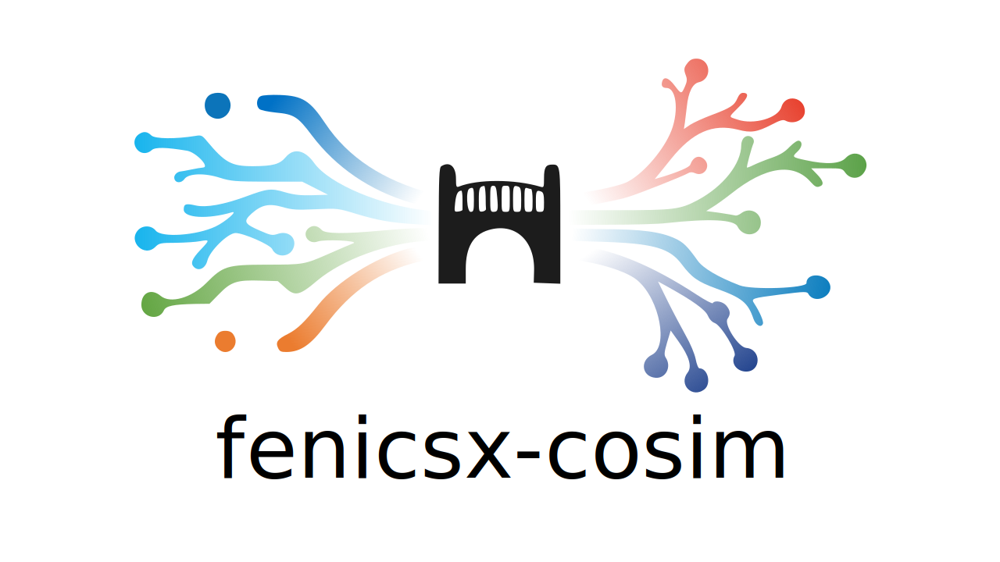

# fenicsx-cosim

<p align="center">
  
</p>

[](https://github.com/LavakumarVeludandi/fenicsx_cosim/actions/workflows/ci.yml)
[](https://pypi.org/project/fenicsx-cosim)
[](https://codecov.io/gh/LavakumarVeludandi/fenicsx_cosim)
[](LICENSE)
[](https://lavakumarveludandi.github.io/fenicsx_cosim/)

**Documentation:** [https://lavakumarveludandi.github.io/fenicsx_cosim/](https://lavakumarveludandi.github.io/fenicsx_cosim/)

**A Native Partitioned Multiphysics Coupling Library for FEniCSx**

`fenicsx-cosim` is a standalone Python package that enables partitioned multiphysics co-simulation for [FEniCSx](https://fenicsproject.org/) (v0.10+). Inspired by the architecture of [Kratos CoSimIO](https://github.com/KratosMultiphysics/CoSimIO), it provides a non-intrusive API for connecting independent FEniCSx solvers across different processes.

## Features

- **Clean API** — A single `CouplingInterface` class hides all networking and mapping complexity
- **ZeroMQ IPC** — Uses PyZMQ for inter-process communication that doesn't interfere with FEniCSx's internal MPI
- **Automatic Mesh Mapping** — Nearest-neighbor interpolation via `scipy.spatial.KDTree` for non-conforming boundaries
- **FEniCSx Native** — Works directly with `dolfinx.fem.Function`, `dolfinx.mesh.Mesh`, and `MeshTags`
- **Multiple Coupling Topologies** — `PAIR` (1-to-1), `PUSH/PULL` scatter-gather FE², and `REQ/REP` demand-driven FE² broker support
- **Adapter-Based Integration** — Native adapter abstractions for FEniCSx, Kratos, and Abaqus workflows

## Installation

```bash
pip install fenicsx-cosim
```

For local development:
```bash
pip install -e ".[dev]"
```

For FEniCSx-based workflows:
```bash
pip install -e ".[fenicsx]"
```

### Dependencies

| Package | Type | Purpose |
|---|---|
| `numpy >= 1.24.0` | Core | Array manipulation |
| `pyzmq >= 25.0.0` | Core | Inter-process communication |
| `scipy >= 1.10.0` | Core | KDTree-based mapping |
| `fenics-dolfinx >= 0.10.0` | Optional (`fenicsx`) | FEniCSx coupling backend |
| `mpi4py` | Optional (`fenicsx`) | MPI support for FEniCSx runs |

## Quick Start

### Thermal Solver (Terminal 1)

```python
import dolfinx
from mpi4py import MPI
from fenicsx_cosim import CouplingInterface

# Standard FEniCSx setup
mesh = dolfinx.mesh.create_unit_square(MPI.COMM_WORLD, 20, 20)
V = dolfinx.fem.functionspace(mesh, ("Lagrange", 1))
temperature = dolfinx.fem.Function(V)

# Initialize co-simulation
cosim = CouplingInterface(name="ThermalSolver", partner_name="MechanicalSolver")
cosim.register_interface(mesh, facet_tags, marker_id=1, function_space=V)

# Time loop
while t < T:
    # ... solve thermal problem ...
    cosim.export_data("TemperatureField", temperature)
    cosim.import_data("DisplacementField", displacement)
    cosim.advance_in_time()
```

### Mechanical Solver (Terminal 2)

```python
from fenicsx_cosim import CouplingInterface

cosim = CouplingInterface(name="MechanicalSolver", partner_name="ThermalSolver")
cosim.register_interface(mesh, facet_tags, marker_id=1, function_space=V)

while t < T:
    cosim.import_data("TemperatureField", temperature)
    # ... solve mechanical problem ...
    cosim.export_data("DisplacementField", displacement)
    cosim.advance_in_time()
```

## Architecture

```
┌─────────────────────────┐         ZeroMQ          ┌─────────────────────────┐
│     Thermal Solver      │ ◄════════════════════► │   Mechanical Solver     │
│                         │     TCP / IPC            │                         │
│  ┌───────────────────┐  │                         │  ┌───────────────────┐  │
│  │ CouplingInterface │  │                         │  │ CouplingInterface │  │
│  │  ├─ MeshExtractor │  │                         │  │  ├─ MeshExtractor │  │
│  │  ├─ Communicator  │  │                         │  │  ├─ Communicator  │  │
│  │  └─ DataMapper    │  │                         │  │  └─ DataMapper    │  │
│  └───────────────────┘  │                         │  └───────────────────┘  │
└─────────────────────────┘                         └─────────────────────────┘
```

### Core Components

| Component | Description |
|---|---|
| `CouplingInterface` | User-facing API — orchestrates everything |
| `MeshExtractor` | Extracts boundary DoFs and coordinates from FEniCSx meshes |
| `Communicator` | ZeroMQ `PAIR` sockets for bidirectional data exchange |
| `DataMapper` | `scipy.spatial.KDTree` nearest-neighbor mapping for non-conforming meshes |
| `DynamicMapper` | Handles AMR mesh-remapping via ZeroMQ mesh-update negotiation |
| `QuadratureExtractor` | FE² integration point data extraction (via basix & ufl) |
| `ScatterGatherCommunicator` | ZeroMQ `PUSH/PULL` sockets for parallel RVE dispatch |
| `DemandDrivenBroker` | ZeroMQ `REQ/REP` demand-driven scheduling for dynamically balanced FE² workers |
| `SolverAdapter` + adapters | External solver bridge abstractions (`FEniCSxAdapter`, `KratosAdapter`, `AbaqusFileAdapter`) |

## Advanced Examples

### 1. Adaptive Mesh Refinement (AMR)
Demonstrates a thermal solver that refines its mesh mid-simulation, seamlessly negotiating the new interpolation mapping with a static-mesh mechanical solver.

Terminal 1:
```bash
export PYTHONPATH=src
python examples/amr_thermal_solver.py
```

Terminal 2:
```bash
export PYTHONPATH=src
python examples/amr_mechanical_solver.py
```

### 2. Multiscale FE² Homogenization
Demonstrates an FE² macro-solver dispatching quadrature-point strains to a pool of microscopic (RVE) workers in parallel, and gathering homogenized stresses.

Terminal 1 (Master):
```bash
export PYTHONPATH=src
python examples/fe2_macro_solver.py
```

Terminals 2+ (Workers):
```bash
# Run this in as many terminals as you want workers!
export PYTHONPATH=src
python examples/fe2_micro_worker.py
```

### 3. Shakedown Verification Loop
Demonstrates extracting whole sparse stiffness matrices from FEniCSx and beaming them to a mock Gurobi/Mosek optimizer on another process to compute a kinematic safety factor.

Terminal 1 (FEniCSx Master):
```bash
export PYTHONPATH=src
python examples/shakedown_fenicsx_master.py
```

Terminal 2 (Optimizer Worker):
```bash
export PYTHONPATH=src
python examples/shakedown_optimizer_worker.py
```

### 4. Coupling with Kratos Multiphysics (via ZeroMQ)
Demonstrates the `KratosAdapter` coupling a FEniCSx mechanical solver to a native Kratos thermal solver in real-time.

Terminal 1 (Kratos thermal Server):
```bash
export PYTHONPATH=src
python examples/kratos_thermal_solver.py
```

Terminal 2 (FEniCSx mechanical Client):
```bash
export PYTHONPATH=src
python examples/fenicsx_kratos_mechanical.py
```

### 5. File-Based Staggered Coupling with Abaqus
Demonstrates the `AbaqusFileAdapter` syncing a FEniCSx thermal solver with an Abaqus Python wrapper using shared NumPy `.npy` files.

Terminal 1 (FEniCSx thermal Client):
```bash
export PYTHONPATH=src
python examples/fenicsx_abaqus_thermal.py
```

Terminal 2 (Abaqus wrapper Server):
```bash
export PYTHONPATH=src
python examples/abaqus_coupling_wrapper.py
```

## Running Tests

Install development dependencies and run tests from the repository root:

```bash
pip install -e ".[dev]"
export PYTHONPATH=src
pytest tests/ -v
```

Note: tests that require `fenics-dolfinx` are automatically skipped when DOLFINx is unavailable.

## Development Roadmap

For current and planned work, see:

- [`ROADMAP.md`](ROADMAP.md)
- [`CHANGELOG.md`](CHANGELOG.md)
- [`CONTRIBUTING.md`](CONTRIBUTING.md)

## License

This project is licensed under the [MIT License](LICENSE).

Copyright (c) 2026 Lavakumar Veludandi

Permission is hereby granted, free of charge, to any person obtaining a copy
of this software and associated documentation files (the "Software"), to deal
in the Software without restriction, including without limitation the rights
to use, copy, modify, merge, publish, distribute, sublicense, and/or sell
copies of the Software, and to permit persons to whom the Software is
furnished to do so, subject to the conditions stated in the [LICENSE](LICENSE) file.

THE SOFTWARE IS PROVIDED "AS IS", WITHOUT WARRANTY OF ANY KIND, EXPRESS OR
IMPLIED. See the [LICENSE](LICENSE) file for details.
